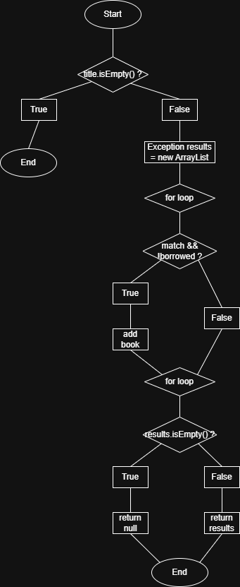
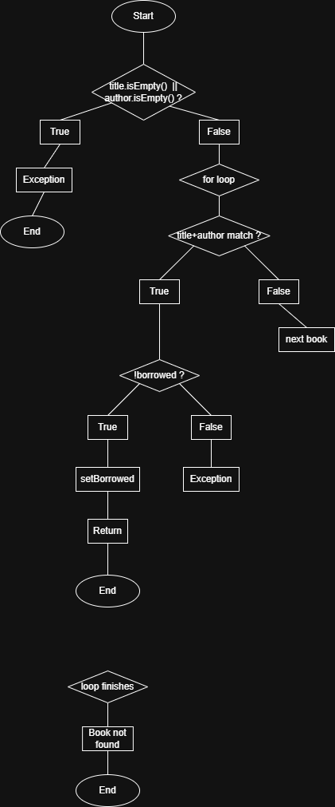

# SI_2026_lab2_222071

## Student Information

* Name and Surname: Hristijan Piperkovski
* Index: 222071

---

# Control Flow Graphs

## searchBookByTitle

### Cyclomatic Complexity

Decision points:

1. `if (title.isEmpty())`
2. `for (Book book : books)`
3. `if (book.getTitle().equalsIgnoreCase(title) && !book.isBorrowed())`
4. `if (results.isEmpty())`

Cyclomatic Complexity:

M = Number of decision points + 1

M = 4 + 1 = 5

---

## borrowBook

### Cyclomatic Complexity

Decision points:

1. `if (title.isEmpty() || author.isEmpty())`
2. `for (Book book : books)`
3. `if (book.getTitle().equalsIgnoreCase(title) && book.getAuthor().equalsIgnoreCase(author))`
4. `if (!book.isBorrowed())`

Cyclomatic Complexity:

M = Number of decision points + 1

M = 4 + 1 = 5

---

# Every Statement Testing

## Function: searchBookByTitle

### Test Case 1 - Empty Title

Input:

* title = ""

Expected result:

* IllegalArgumentException

Covered statements:

* Validation check
* Exception throw statement

### Test Case 2 - Existing Book

Input:

* title = "Clean Code"

Expected result:

* List containing one book

Covered statements:

* List initialization
* Loop execution
* Matching condition
* Adding book to results
* Returning results

### Test Case 3 - Non-existing Book

Input:

* title = "Unknown Book"

Expected result:

* null

Covered statements:

* Loop execution
* Empty results check
* Returning null

Minimal number of test cases required: 3

---

# Every Branch Testing

## Function: borrowBook

### Test Case 1 - Empty Input

Input:

* title = ""
* author = ""

Expected result:

* IllegalArgumentException

Covered branch:

* Validation condition = true

### Test Case 2 - Successful Borrow

Input:

* title = "Clean Code"
* author = "Robert"

Expected result:

* Book borrowed successfully

Covered branches:

* Validation condition = false
* Book found condition = true
* Borrowed condition = false

### Test Case 3 - Already Borrowed

Input:

* title = "Clean Code"
* author = "Robert"

Expected result:

* RuntimeException("Book is already borrowed.")

Covered branch:

* Borrowed condition = true

### Test Case 4 - Book Not Found

Input:

* title = "Nonexistent"
* author = "Unknown"

Expected result:

* RuntimeException("Book not found")

Covered branch:

* Book found condition = false

Minimal number of test cases required: 4

---

# Multiple Condition Testing

## borrowBook

Condition:

`title.isEmpty() || author.isEmpty()`

| Test Case | title.isEmpty() | author.isEmpty() | Result |
| --------- | --------------- | ---------------- | ------ |
| 1         | T               | T                | T      |
| 2         | T               | F                | T      |
| 3         | F               | T                | T      |
| 4         | F               | F                | F      |

Minimal number of test cases required: 4

---

## searchBookByTitle

Condition:

`book.getTitle().equalsIgnoreCase(title) && !book.isBorrowed()`

| Test Case | Title Match | Not Borrowed | Result |
| --------- | ----------- | ------------ | ------ |
| 1         | T           | T            | T      |
| 2         | T           | F            | F      |
| 3         | F           | T            | F      |
| 4         | F           | F            | F      |

Minimal number of test cases required: 4

---

# Source Code and Tests

The Gradle project contains:

* SI2026Lab2Main.java
* SI2026Lab2Test.java

All tests execute successfully using Gradle and JUnit 5.
